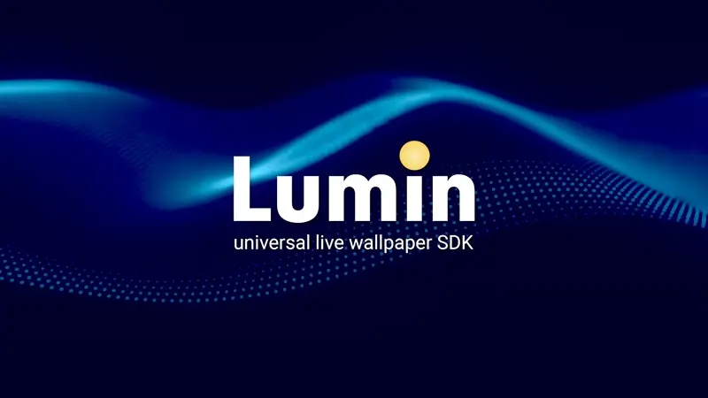

# Lumin - Live Wallpaper SDK 


This library allows users to create dynamic wallpapers on Windows, macOS and Linux   
using the game or render engine of your choice!

## Previews



## Features

- Supports Windows 11 24H2 and prior!
- Provides mouse input replacements for interactive desktops
- Supports Multi Monitor Setups and is DPI aware.
- Doesn't Render if Wallpaper or Monitor is occluded

## Getting Started

### Installation

Simply add the library to your CMake Config
```md
# Pin a tag or branch
set(LWP_GIT_TAG main CACHE STRING "Git tag/branch for LuminWallpaper")

# Fetch LuminWallpaper
FetchContent_Declare(
  lumin
  GIT_REPOSITORY https://github.com/jensroth-git/LuminWallpaper.git
  GIT_TAG ${LWP_GIT_TAG}
)
FetchContent_MakeAvailable(lumin)

# Add to target
target_link_libraries(myApp PRIVATE lumin)
```

### General integration
The only requirement is that you get a handle to the window the engine is using to render and pass it into 
`lumin::ConfigureWallpaperWindow(engineWindowHandle, monitorInfo);`  
along with the info for which montors desktop should be replaced.

- `HWND` on Windows 
- `NSWindow` on macOS
- `X11Window` on Linux

### RayLib integration
```cpp
#include <iostream>

#include <lumin.h>
#include <raylib.h>

int main()
{
	// Initializes desktop replacement magic
	lumin::Initialize();

	// Sets up the desktop (-1 is the entire desktop spanning all monitors)
	lumin::MonitorInfo monitorInfo = lumin::GetWallpaperTarget(-1);

	// Initialize the raylib window.
	InitWindow(monitorInfo.width, monitorInfo.height, "Raylib Desktop Demo");

	// Retrieve the handle for the raylib-created window.
	void *raylibWindowHandle = GetWindowHandle();

	// Reparent the raylib window to the window behind the desktop icons.
	lumin::ConfigureWallpaperWindow(raylibWindowHandle, monitorInfo);

	// Now, enter the raylib render loop.
	SetTargetFPS(60);

	// Main render loop.
	while (!WindowShouldClose()) {
		// Update the mouse state of the replacement api.
		lumin::UpdateMouseState();

		// skip rendering if the wallpaper is occluded more than 95%
		if (lumin::IsMonitorOccluded(monitorInfo, 0.95)) {
			std::cout << "Wallpaper is occluded" << std::endl;
			WaitTime(0.1);
			continue;
		}

		if (lumin::IsDesktopLocked() ) {
			std::cout << "Desktop is locked" << std::endl;
			// If the desktop is locked, we can skip rendering.
			// This is useful to avoid unnecessary rendering when the user is not interacting with the desktop.
			WaitTime(0.1);
			continue;
		}

		// Begin the drawing phase.
		BeginDrawing();
		ClearBackground(RAYWHITE);

		DrawText(TextFormat("Mouse: %d, %d", lumin::GetMouseX(), lumin::GetMouseY()), 10, 10, 30, DARKGRAY);

		EndDrawing();
	}

	// Close the window and unload resources.
	CloseWindow();

	// Clean up the desktop window.
	// Restores the original wallpaper.
	lumin::Cleanup();

	return 0;
}
```

### Unity integration
TODO...

### Unreal integration
TODO...

## Future Plans
Currently, there are no replacements for keyboard input, which may be added in the future.

## License

This project is licensed under the MIT License.